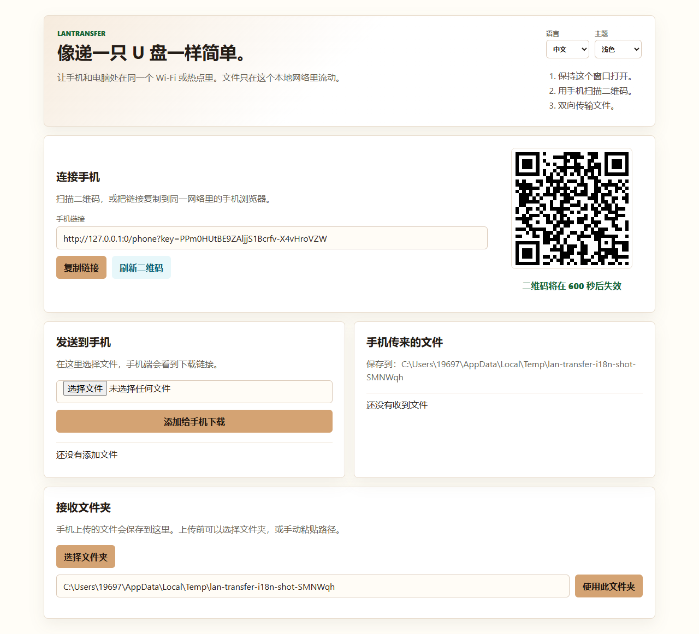
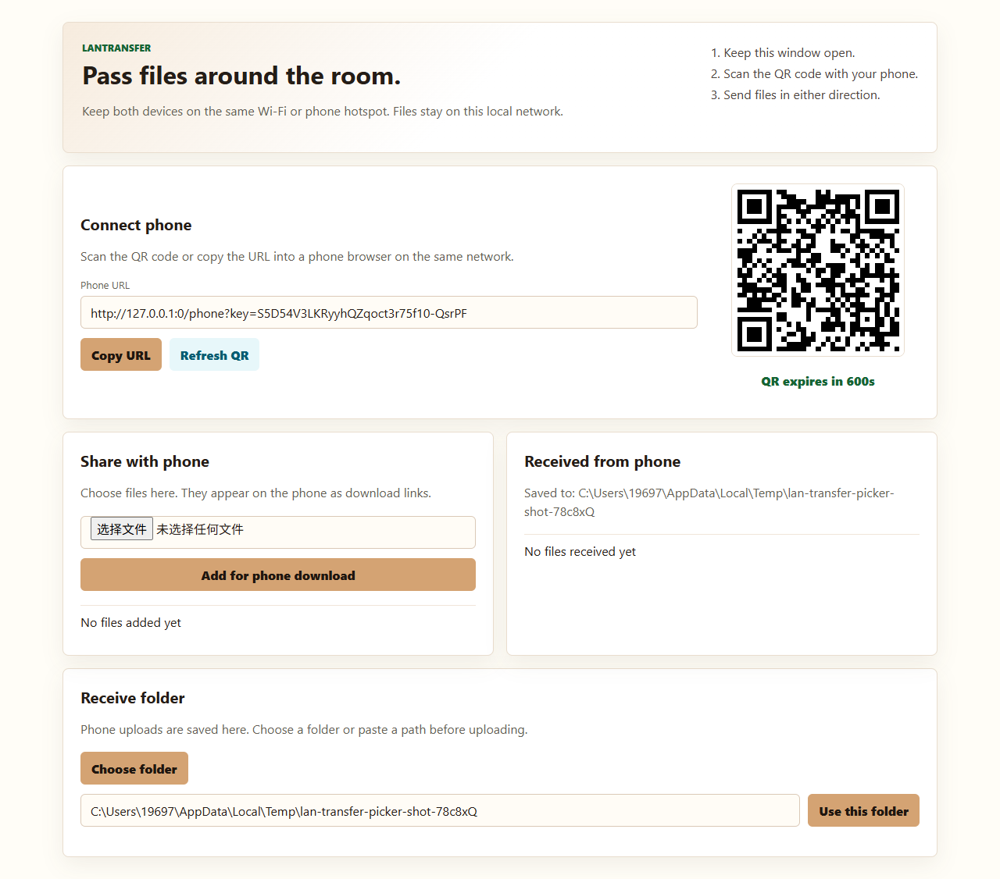
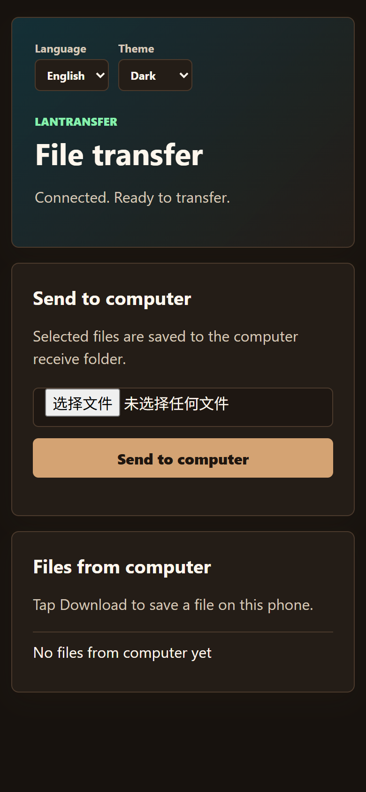
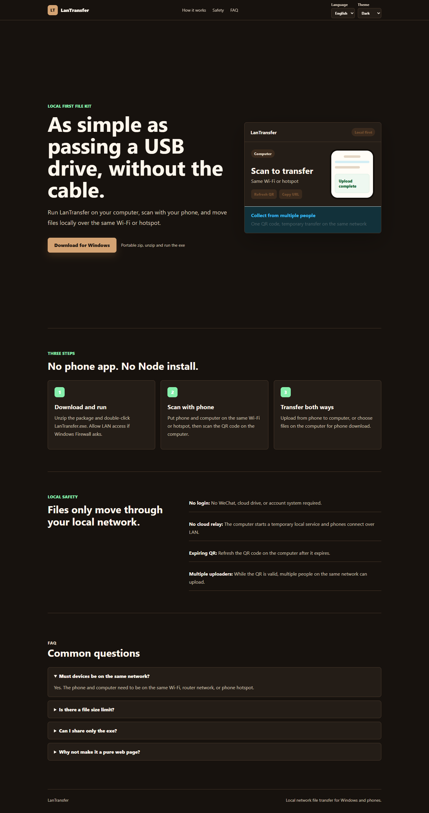

# LanTransfer

[中文](README.md) | **English**

> A local-first file transfer tool for Windows and phones. No login, no cloud relay, no cable.

LanTransfer starts a temporary local web service on a Windows computer. Phones on the same Wi-Fi or hotspot scan a QR code and use their browser to upload or download files.



## Why

Moving files between a Windows computer and a phone often means logging in to chat apps, using cloud drives, or finding a cable. LanTransfer keeps that workflow local:

- **No account required**: no WeChat login, no cloud-drive account, no registration.
- **Local network only**: files move between devices on the same LAN or phone hotspot.
- **Phone browser friendly**: no phone app required.
- **Windows portable package**: unzip and run the executable.
- **Two-way transfer**: phone to computer and computer to phone.
- **Native receive folder picker**: choose where phone uploads are saved.
- **Expiring QR code**: refresh or invalidate access from the computer.
- **Chinese / English UI** and **light / dark / system theme**.

## Screenshots

| Computer console | Phone page |
| --- | --- |
|  |  |

| Download page |
| --- |
|  |

## Download

Download the latest Windows portable package from:

```text
https://github.com/kimchaungo239-ui/LanTransfer/releases/latest/download/LanTransfer-Windows.zip
```

## Quick Start

### Use the portable package

1. Unzip `LanTransfer-Windows.zip`.
2. Double-click `LanTransfer.exe`.
3. Allow LAN access if Windows Firewall asks.
4. Keep the computer and phone on the same Wi-Fi or phone hotspot.
5. Scan the QR code with the phone.
6. Transfer files in either direction.

### Run from source

Requirements:

- Node.js 24+
- Windows for the native folder picker and packaged release flow

```powershell
npm install
npm start
```

## Build

Build the Windows portable package:

```powershell
npm run build:win
```

Optional output override:

```powershell
$env:LANTRANSFER_PORTABLE_OUTPUT="D:\Release\lan-transfer-portable"
npm run build:win
```

Build the static download page:

```powershell
npm run build:site
```

Optional output override:

```powershell
$env:LANTRANSFER_SITE_OUTPUT="D:\Release\lan-transfer-site"
npm run build:site
```

Run tests:

```powershell
npm test
```

## Architecture

```text
Windows computer
  LanTransfer.exe
    Local Express server
    QR/session manager
    File store
    Native folder picker

Phone
  Browser page opened from QR code
    Upload files to computer
    Download files shared by computer
```

Main source layout:

```text
src/
  index.js                 App startup and LAN URL printing
  app.js                   Express app wiring
  file-store.js            Shared and received file registry
  session.js               Expiring QR access keys
  native-folder-picker.js  Windows folder picker bridge
  routes/
    api.js                 Transfer and console APIs
    pages.js               Computer and phone pages
  public/
    console.js             Computer console behavior
    phone.js               Phone page behavior
    preferences*.js        Language and theme preferences
    styles.css             Tool UI styles

site/                      Static download page
scripts/                   Portable and site build scripts
test/                      Node test suite
```

## Security Model

LanTransfer is designed for trusted local networks.

- The QR code contains a temporary access key.
- Requests without the current key are rejected.
- Refreshing the QR code invalidates old phone links.
- The native receive-folder picker can only be triggered from the local computer.
- Files are not uploaded to a cloud service by this tool.

Anyone on the same network who has the active QR/link can upload files while the key is valid. Use it on networks you trust, and refresh or stop the tool when a transfer session is finished.

## Current Scope

Implemented:

- Windows portable executable
- Phone browser upload to computer
- Computer file selection for phone download
- Custom receive folder, including native Windows folder picker
- Chinese filename repair for common browser upload mojibake
- Chinese/English interface
- Light/dark/system theme
- Static download page

Not yet implemented:

- End-to-end encryption beyond local HTTP transport
- Transfer resume for very large files
- Mobile app or PWA share-target integration
- Automatic updater
- Code signing

## Roadmap

- Single-file packaging for the public release.
- Drag-and-drop file sharing from the computer page.
- Progress bars for large uploads.
- Session modes: single-device mode, collect-only mode, and multi-person collection mode.
- Better release automation and checksums.
- Optional signed Windows releases.

## License

MIT. See [LICENSE](LICENSE).
