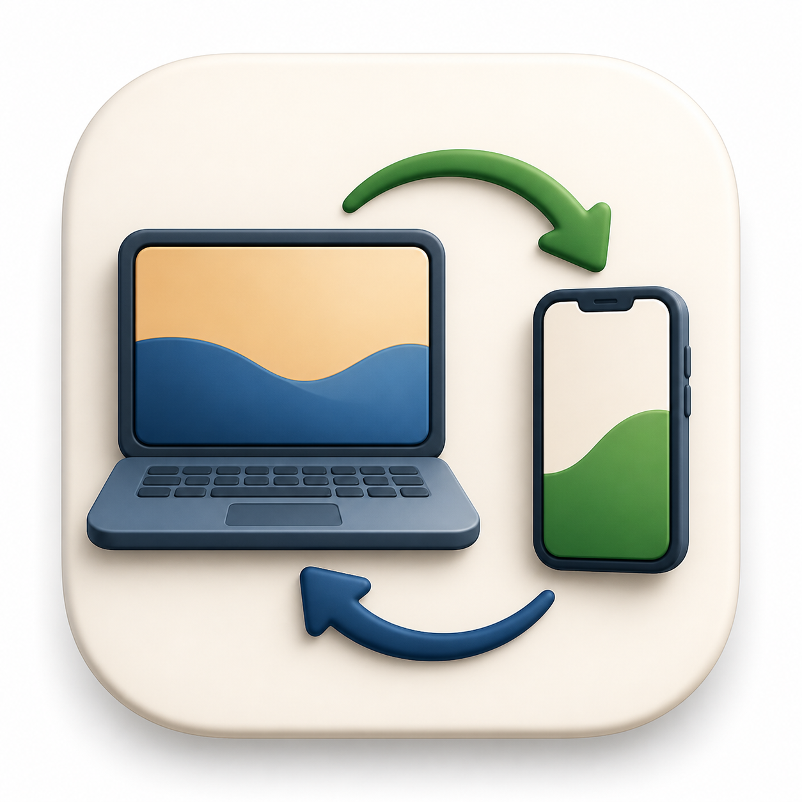

# LanTransfer

**中文** | [English](README.en.md)

<p align="center">
  
</p>

> 一个面向 Windows 与手机的局域网文件传输工具。不用登录，不走云端，不需要数据线。

LanTransfer 会在 Windows 电脑上临时启动一个本地传输服务。手机和电脑处在同一个 Wi-Fi、局域网或手机热点下时，手机扫码即可在浏览器里上传或下载文件。

**作者**：Henry


## 为什么做它

电脑和手机之间传文件，经常要登录聊天软件、网盘，或者到处找数据线。LanTransfer 的目标是把这件事变回一个很直接的本地动作：

- **不用账号**：不需要微信登录、网盘账号或注册流程。
- **只走局域网**：文件在同一局域网或手机热点内传输。
- **手机浏览器可用**：手机端不用安装 App。
- **Windows 便携包**：解压后直接运行。
- **双向互传**：支持手机传电脑，也支持电脑传手机。
- **原生接收目录选择器**：电脑端可以选择手机上传文件的保存位置。
- **二维码定时失效**：电脑端可刷新二维码，让旧链接失效。
- **中英文界面**，支持 **浅色 / 深色 / 跟随系统** 主题。

## 截图

| 电脑控制台 | 手机页面 |
| --- | --- |
|  |  |

| 下载页 |
| --- |
|  |

## 下载

最新版 Windows 便携包下载地址：

```text
https://github.com/kimchaungo239-ui/LanTransfer/releases/latest/download/LanTransfer-Windows.zip
```

## 快速开始

### 使用便携版

1. 下载并解压 `LanTransfer-Windows.zip`。
2. 双击运行 `LanTransfer.exe`。
3. 如果 Windows 防火墙提示，允许局域网访问。
4. 让电脑和手机连接到同一个 Wi-Fi、局域网或手机热点。
5. 用手机扫描电脑窗口里的二维码。
6. 在手机浏览器和电脑页面之间双向传文件。

### 从源码运行

要求：

- Node.js 24+
- Windows 环境用于原生文件夹选择器和便携包构建流程

```powershell
npm install
npm start
```

## 构建

构建 Windows 便携包：

```powershell
npm run build:win
```

可选：自定义便携包输出目录：

```powershell
$env:LANTRANSFER_PORTABLE_OUTPUT="D:\Release\lan-transfer-portable"
npm run build:win
```

构建静态下载页：

```powershell
npm run build:site
```

可选：自定义下载页输出目录：

```powershell
$env:LANTRANSFER_SITE_OUTPUT="D:\Release\lan-transfer-site"
npm run build:site
```

运行测试：

```powershell
npm test
```

## 技术栈

- **Node.js 24**：本地传输服务运行时。
- **Express**：提供电脑端、手机端页面和文件传输 API。
- **Multer**：处理浏览器上传的文件。
- **qrcode**：生成手机扫码访问链接。
- **HTML / CSS / Vanilla JavaScript**：实现电脑端控制台、手机端页面和下载页。
- **PowerShell + .NET Windows Forms**：实现 Windows 原生文件夹选择器。
- **esbuild + Node SEA + postject**：构建 Windows 便携可执行文件。
- **Node.js test runner**：覆盖会话、上传、文件列表、语言和主题等核心逻辑。
- **GitHub Releases**：分发 Windows 便携包。

## 架构

```text
Windows computer
  LanTransfer.exe
    Local Express server
    QR/session manager
    File store
    Native folder picker

Phone
  Browser page opened from QR code
    Upload files to computer
    Download files shared by computer
```

主要源码结构：

```text
src/
  index.js                 应用启动与局域网地址输出
  app.js                   Express 应用组装
  file-store.js            分享文件与接收文件记录
  session.js               二维码访问密钥与失效逻辑
  native-folder-picker.js  Windows 文件夹选择器桥接
  routes/
    api.js                 传输与控制台 API
    pages.js               电脑端与手机端页面
  public/
    console.js             电脑控制台交互
    phone.js               手机页面交互
    preferences*.js        语言与主题偏好
    styles.css             工具界面样式

site/                      静态下载页
scripts/                   便携包与下载页构建脚本
test/                      Node 测试套件
```

## 安全模型

LanTransfer 面向可信局域网使用。

- 二维码中包含临时访问密钥。
- 没有当前密钥的请求会被拒绝。
- 刷新二维码会让旧的手机链接失效。
- 原生接收目录选择器只能由本机电脑端触发。
- 文件不会被这个工具上传到云端服务。

只要某个人处在同一网络内，并且拿到了当前有效二维码或链接，他就能在密钥有效期间上传文件。建议只在可信网络中使用，传输结束后刷新二维码或关闭工具。

## 当前范围

已经实现：

- Windows 便携可执行文件
- 手机浏览器上传文件到电脑
- 电脑选择文件供手机下载
- 自定义接收目录，包括 Windows 原生文件夹选择器
- 常见中文文件名乱码修复
- 中英文界面
- 浅色 / 深色 / 跟随系统主题
- 静态下载页

暂未实现：

- 局域网 HTTP 传输之外的端到端加密
- 超大文件断点续传
- 手机 App 或 PWA 分享目标集成
- 自动更新
- 代码签名

## 路线图

- 发布包进一步收敛为更轻的单文件形态。
- 电脑端拖拽分享文件。
- 大文件上传进度条。
- 会话模式：单设备模式、收集模式、多人收集模式。
- 更完善的发布自动化和校验和。
- 可选的 Windows 签名发布。

## 许可证

MIT。详见 [LICENSE](LICENSE)。
